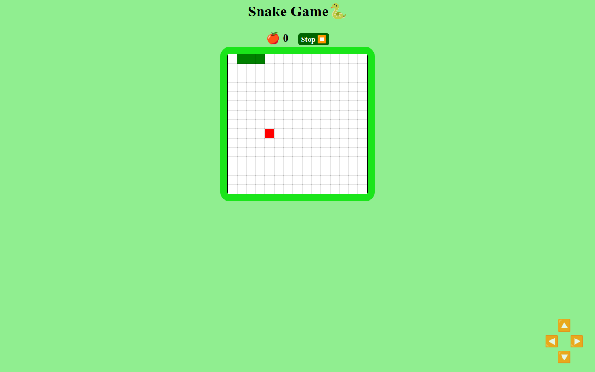

# Snake Game

## Overview

Welcome to the Snake Game project! This classic arcade game lets users control a snake to eat apples and grow longer. Built with HTML, CSS, and JavaScript, the project provides a nostalgic gaming experience with modern functionalities.

### Table of Contents

- [Installation](#installation)
- [How to use](#how-to-use)
- [Technologies Used](#technologies-used)
- [Features](#features)
- [Project Structure](#project-structure)
- [Credits](#credits)
- [License](#license)



## Installation

To run this project locally, follow these steps:

1. Clone the repository to your local machine.
    ```bash
    git clone https://github.com/m-ramzan786/Snake-Game.git
    ```

2. Open the project folder in your code editor.

3. Open the `index.html` file in your web browser.

## How to Use

To use the Snake Game:

1. Open the [live demo](https://snake-game-phi-two.vercel.app/) or run it locally.

2. Control the snake's movement using arrow keys on the keyboard or the provided buttons.

3. Pause the game anytime with the "Stop" button.

4. The game ends if the snake touches the wall, and a popup window displays the score.

5. Click "Reset" to start a new game.

## Technologies Used

- HTML
- CSS
- JavaScript
- Audio (for sound effects)

## Features

- **Stop Button:** Pause the game with the "Stop" button.

- **Movement Buttons:** Four buttons allow users to control snake movement using touch or mouse.

- **Keyboard Controls:** Play the game using arrow keys on the keyboard.

- **Game Over Popup:** A popup window displays the user's score when the snake touches the wall.

- **Start/Reset Button:** Begin a new game or reset the current one.

- **Sound Effects:** Enjoy audio feedback when the snake eats an apple or the game ends.

- **User-Friendly Interface:** Simple design for ease of use.

- **Responsive:** Responsive design for various screen sizes.

## Project Structure

The project is organized for easy navigation and features a clean and visually appealing design.

## Future Enhancements

- **Difficulty Levels:** Implement different difficulty settings for varied gameplay.

- **Leaderboard:** Add a leaderboard to track high scores.

## Credits

- [Muhammad Ramzan](https://github.com/m-ramzan786) - Project Creator

## License

This project is licensed under the [MIT License](LICENSE). Feel free to use and modify the code as per the license terms.

## Badges


## How to Contribute

If you'd like to contribute to the project, follow these steps:

1. Fork the project.
2. Create a new branch for your feature: `git checkout -b feature-name`.
3. Commit your changes: `git commit -m 'Add new feature'`.
4. Push to the branch: `git push origin feature-name`.
5. Open a pull request.

## Contact

If you have any questions, suggestions, or just want to connect, feel free to reach out:

- Email: [mramzanstv@gmail.com](mramzanstv@gmail.com)
- Portfolio: [Muhammad-Ramzan-Portfolio](https://muhammad-ramzan.vercel.app/)
- LinkedIn: [in/m-ramzan786](https://www.linkedin.com/in/m-ramzan786/)

## Tests

The project includes a set of tests to ensure the functionality is working as expected. To run the tests, use the following command:
```bash
npm test
```

Enjoy the classic Snake Game adventure!
